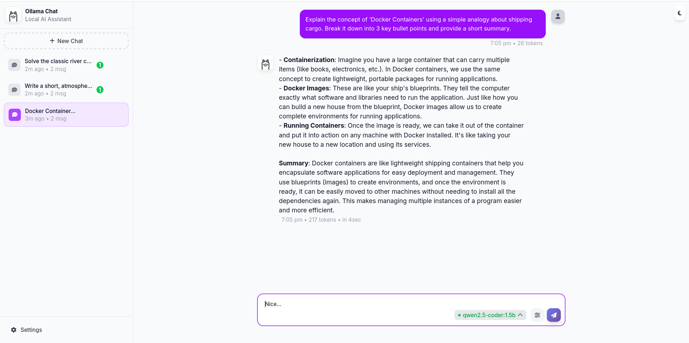
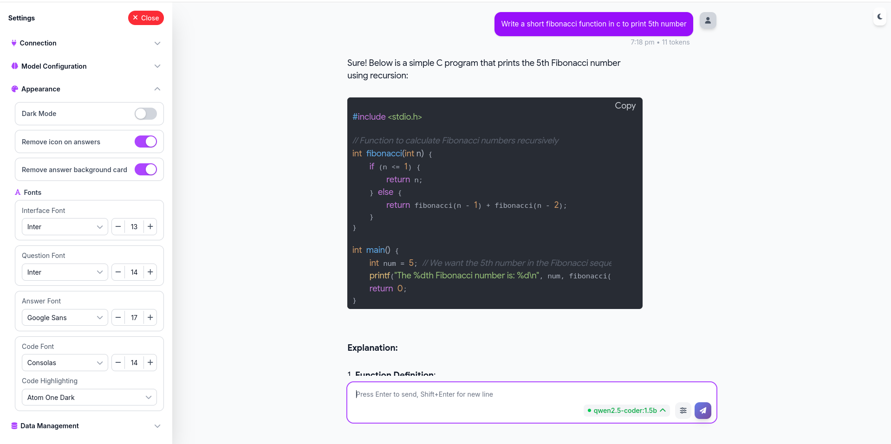

# Ollama WebUI

A purely browser-based, lightweight interface for Ollama models. 

**Zero dependencies. No Docker. No Node.js.** Just download the HTML file and run it.
## ✨ Interface Design
**Chat Interface**

**Customization settings**

## ✨ Features

- **🚀 Zero Setup:** No installation required. Just open `index.html`.
- **🔌 Fully Offline:** Runs entirely on your local machine. No internet required.
- **🧠 Auto-Detection:** Automatically detects all models installed in your local Ollama instance.
- **🔀 Multi-Model Support:** Switch between models instantly or use multiple models during your session.
- **🎨 Customization:** User-friendly settings to customize the interface and behavior to your needs.
- **⚡ Lightweight:** A single file implementation designed for speed and simplicity.
     

## 🛠️ Usage

1.  **Download the Project:**
    Clone the repo or just download the `index.html` file.
    ```bash
    git clone [https://github.com/godus3r/ollama-webui.git](https://github.com/godus3r/ollama-webui.git)
    ```
2.  **Open the File:**
    Double-click `index.html` to open it in your default web browser.

3.  **Start Chatting:**
    The interface will automatically connect to your running Ollama instance (default: `http://localhost:11434`), list your available models, and you are ready to go.
    
